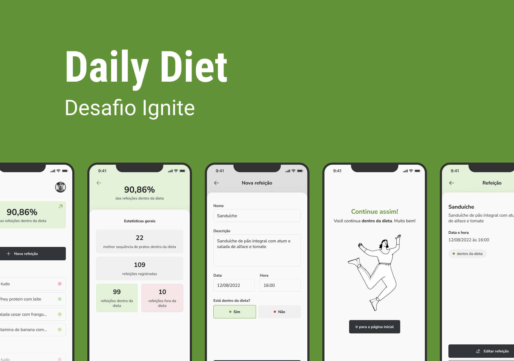

<p align="center">
  
</p>

<h1 align="center">
	Daily Diet
</h1>

<p align="center">Desafio 02 - Daily Diet</p>

<p align="center">
  <a href="https://github.com/italoalvesdev">
    
  </a>

  <a href="https://www.linkedin.com/in/italo-alvess/" target="_blank">
    
  </a>
</p>

## 🚀 Projeto

Aplicação de controle de refeições para quem está começando na dieta, que contém as seguintes funcionalidades:
- Adicionar uma nova refeição
- Editar uma refeição
- Remover uma refeição da listagem
- Mostrar as estatísticas do progresso da dieta
- Navegação entre telas em pilha
- Armazenamento local das refeições

## 🔧 Tecnologias

- React Native
- TypeScript
- [Styled Components](https://styled-components.com/)
- [React Navigations](https://reactnavigation.org/)
- [React Native Async Storage](https://react-native-async-storage.github.io/async-storage/)
- [React Native Safe Area Context](https://github.com/th3rdwave/react-native-safe-area-context)
- [Phosphor React Native](https://phosphoricons.com/)

## 🔖 Layout

Você pode visualizar o layout do projeto através [desse link](https://www.figma.com/file/JVjqTgAQ7f4cutwv4H79KV/Daily-Diet/duplicate). É necessário ter conta no [Figma](http://figma.com/) para acessá-lo.


## :octocat: Instalação

### Requisitos
- [Expo-CLI](https://docs.expo.dev/get-started/installation/)

Para clonar o repositório

```sh
git clone https://github.com/italoalvesdev/dailydiet.git
```

Para instalar as dependências com NPM

```sh
npm install | npm i
```

Para instalar as dependências com Yarn

```sh
yarn | yarn install
```

Iniciar o ambiente de desenvolvimento com NPM no Emulador

```sh
npm run android
```

Iniciar o ambiente de desenvolvimento com Yarn no Emulador

```sh
yarn android
```
---

Feito com ♥ by [Italo Alves](https://www.linkedin.com/in/italo-alvess/)